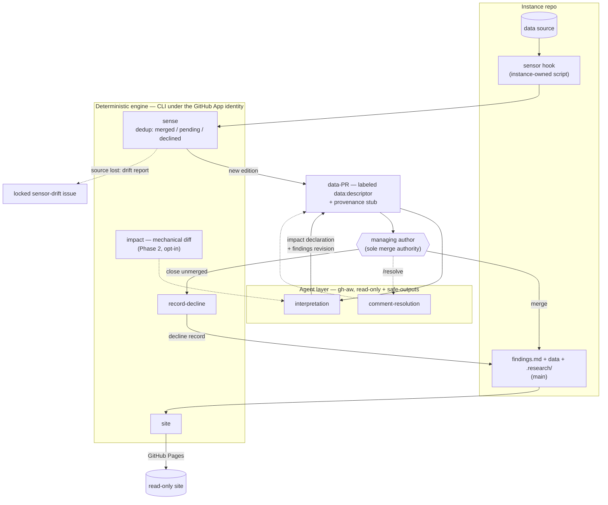

# Continuous Research

A substrate for treating research as a **living, version-controlled, mergeable
artifact** — autonomous agents propose updates as new data, literature, and
reviewer comments arrive, and a managing author accepts them through a
Git-native review workflow.

This is a **framework**; individual research efforts are _instances_ built on
it. Design source of truth: [`CONCEPT.md`](./CONCEPT.md). Build plan and current
status: [`docs/phase-1-plan.md`](./docs/phase-1-plan.md).

## Why this exists

Most research artifacts die the moment they're published: the data keeps
moving, but re-running the analysis is manual toil, so the prose and the
world quietly drift apart — and nothing records *that they drifted*, or what
the drift did to the claims.

This framework makes the maintenance loop the artifact. New data arrives as
a reviewable **data-PR** opened by a deterministic engine; an agent reads it
against the existing claims and writes an **impact declaration** (what is
strengthened, weakened, overturned); a human accepts or declines the change;
and the repo's history — merges, declines, revisions — *is* the evolution
narrative. What gets versioned is not just the findings but every decision
about them
([`CONCEPT.md` § What gets versioned](./CONCEPT.md#what-gets-versioned)).

## How it works — where each behavior happens

*One cycle: the engine proposes deterministically, agents interpret
read-only, and the managing author merges — every decision lands in
history.*

The system is split into **two layers, on purpose**:

1. **The deterministic engine** — this package's CLI (`sense`,
   `record-decline`, `init`). Pure orchestration over the GitHub API (Octokit):
   detect new data, dedup against existing PRs, open the data-PR, record
   declines. **No LLM inference happens here** — it is deterministic and
   unit-tested.
2. **The agent / inference layer** —
   [GitHub Agentic Workflows (`gh-aw`)](https://github.com/github/gh-aw):
   markdown-authored agentic workflows, compiled to Actions, running the
   engine/model each instance configures (the sample runs Gemini; the
   framework is engine-agnostic). The agent executes **read-only**; its
   writes land only through sanitized `safe-outputs` (e.g. pushing onto an
   existing data-PR branch). This is where **inference on the produced
   data** happens: the _interpretation step_ and _comment-resolution_.

Both run inside **GitHub Actions workflows**, which provide the triggers:

| Workflow             | Trigger             | What runs                                                 | Layer  | Status      |
| -------------------- | ------------------- | --------------------------------------------------------- | ------ | ----------- |
| `sense`              | schedule / dispatch | sensor → dedup → (if new) pipeline + open the data-PR     | engine | **built**   |
| `decline`            | PR closed-unmerged  | commit the decline record to `main`                       | engine | **built**   |
| `interpretation`     | a new data-PR       | read the new data + claims → write the impact declaration | agent  | **built**   |
| `comment-resolution` | `/resolve <request>` | address the reviewer's request on the data-PR branch     | agent  | **built**   |
| `site`               | data-PR events / findings pushes | build the read-only site → GitHub Pages       | engine | **built**   |
| `sensor-repair`      | `sensor-drift` issue labeled / dispatch | optional Claude Code integration: two-job drift repair (read-only agent proposes a fix, deterministic job ships it) | agent | **built**   |

The first four run in
[the sample instance](https://github.com/norabble/continuous-research-sample)
— on 2026-07-02 a scheduled cycle sensed a real edition, opened the data-PR
under the App identity, and the gh-aw interpretation agent wrote the impact
declaration onto the PR branch via safe-outputs; comment-resolution was
qualified live on 2026-07-03 (`/resolve` gated to trusted reviewers).

### One cycle, end to end

The instance's **sensor** observes the source and names what it saw with a
**descriptor** — an identity derived from the data itself, not from time or
location. The engine dedups that descriptor against history (merged /
pending / declined; a declined content-state can never re-propose) and, when
it is genuinely new, opens the **data-PR** — labeled `data:<descriptor>`,
carrying the edition artifact and its always-committed **provenance stub**.
That PR triggers the interpretation agent, which writes the **impact
declaration** and revises the living findings on the PR branch. A human
merges — or closes unmerged, leaving a **decline record**. Either way the
decision lands in history, and the accumulated merges, declines, and
revisions are the **evolution narrative**. (All terms:
[`CONCEPT.md` § Canonical terms](./CONCEPT.md#canonical-terms).)

Three actors, three trust levels
([`CONCEPT.md` § Roles](./CONCEPT.md#roles)):

- the **engine**, deterministic code running under a **GitHub App
  identity** (its PRs must trigger downstream workflows; default-token PRs
  don't);
- **agent workflows**, sandboxed in gh-aw, read-only, writing only through
  `safe-outputs` scoped to specific files;
- the **managing author**, the only actor with merge authority — nothing
  changes the published findings without a human decision.

### How is inference on the produced data invoked?

**The engine never calls an LLM.** Inference on the produced data is the
**interpretation step**, performed by the agent layer: a **gh-aw workflow**,
triggered by the engine's data-PR, runs the configured model read-only over
the newly-produced artifacts plus the existing prose/claims and writes the
**impact declaration** (what is strengthened / weakened / overturned) onto the
data-PR branch via the `push-to-pull-request-branch` safe-output. The engine's
only job is to get the new data into a PR _deterministically_; deciding what it
_means_ is the agent's job. (One consequence: the engine must open data-PRs
under a GitHub App identity — default-token PRs don't trigger downstream
workflows.)

> **Status (Phase 1 complete, 2026-07-03).** The full loop — sense → dedup →
> App-authored data-PR → gh-aw interpretation → impact declaration on the PR —
> **runs in CI in the sample instance** on the shipped `npx github:`
> distribution (first complete cycle 2026-07-02, on free-tier inference,
> fail-closed). See the [plan](./docs/phase-1-plan.md) § "Finishing Phase 1"
> for the record.

## Instance layout

An instance declares its project hooks — **sensor**, **pipeline**,
**interpretation** — in `.research/config.json`, and gets the workflows via
`continuous-research init`. Produced artifacts, the always-committed
**provenance stubs** (`.research/provenance/`), and **decline records**
(`.research/decisions/`) live in the instance repo. See
[`norabble/continuous-research-sample`](https://github.com/norabble/continuous-research-sample)
for the worked reference instance (daily BTC-USD editions, live loop).

> **Trust boundary.** The `sensor` (and `pipeline`) declared in
> `.research/config.json` are shell commands the engine executes in CI. They
> sit at the same trust boundary as the workflow files themselves: anyone with
> write access to the instance repo controls both. Review changes to
> `.research/config.json` and the sensor script with the same care as workflow
> changes.

## Adopting it

You bring three things — a sensor script, a descriptor scheme, and merge
judgment; the framework provides everything else (workflows, dedup,
data-PRs, the agent layer, the site). Two documents get a project from zero
to a live loop:

- **[Adoption guide](./docs/adopting.md)** — install in a new or existing
  project: the three hooks, GitHub App setup, repo settings, the agent layer,
  and a first-run verification walkthrough.
- **[CLI + engine reference](./docs/cli.md)** — commands, environment, the
  config schema, the sensor contract, and exactly what the engine writes.

## Status

Phase 1 complete (2026-07-03): `init` scaffolds the proven instance
configuration, and the full loop — including agentic interpretation and
comment-resolution — is qualified live in the sample on the shipped
distribution. Phase 2 is **in progress** ([plan](./docs/phase-2-plan.md)):
the mechanical impact layer's engine half (`impact` command + consistency
linter) ships as an opt-in preview since `v0.1.3`; judgment review,
`resolves_when`, and the storage-policy advisor have not started. Phase 1's
record: [phase-1-plan](./docs/phase-1-plan.md).
